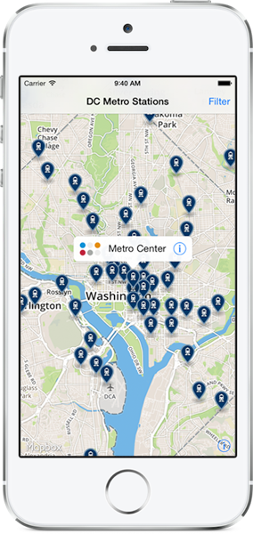

Station Finder
==============

This repo compliments a 4-part series of [Guides](https://www.mapbox.com/guides/) to build a DC Metro station finder with the Mapbox iOS SDK:

1. [Part 1 &mdash; Set up a map with its center and panning locked to the DC area](https://www.mapbox.com/guides/station-finder-part-1/)
2. [Part 2 &mdash; Add markers to the map by parsing a GeoJSON file](https://www.mapbox.com/guides/station-finder-part-2/)
3. [Part 3 &mdash; Customize the marker annotations](https://www.mapbox.com/guides/station-finder-part-3/)
4. [Part 4 &mdash; Add a filter feature to allow users to view specific rail lines](https://www.mapbox.com/guides/station-finder-part-4/)

